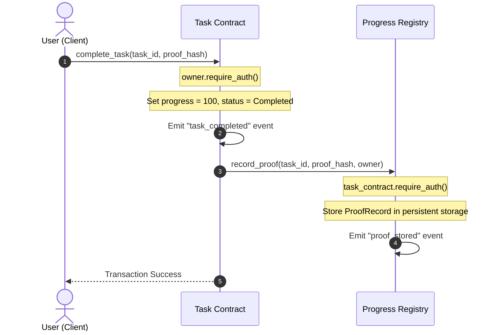

# TaskProof 🚀

> **Every milestone leaves a proof.**

**Live Deployed Application**: [https://taskproof-muskiii.netlify.app/](https://taskproof-muskiii.netlify.app/)

A decentralized, production-grade proof-of-completion platform built on Stellar Soroban. TaskProof enables teams, freelancers, and clients to create tasks, log progress milestones, and record cryptographic proof hashes securely on-chain—maintaining a verifiable, immutable history of work completion.

---

## 📋 Project Overview

### The Problem
In modern remote work, decentralized collaborations, and freelance marketplaces, proving that project milestones have been completed exactly as specified is a frequent source of friction. Disputes over deliverables, delays in payment verification, and lack of transparency often erode trust between clients and developers.

### Why It Matters
Verifying proof of work traditionally relies on centralized platforms or subjective intermediate audits. These systems add fees, introduce single points of failure, and can be manipulated or deleted, destroying historical records of accomplishment.

### Why Blockchain is Required
A trustless, decentralized ledger is the only mechanism that can offer:
1. **Cryptographic Immutability**: Preventing retrospectively modifying task requirements or completion timestamps.
2. **Censorship-Resistant Registry**: Guaranteeing developers own their verified track record independently of any single hosting platform.
3. **Decentralized Verification**: Creating transparent linkages between cryptographic signatures and deliverable hashes that anyone can audit.

### Why Stellar was Chosen
Stellar provides the optimal infrastructure for TaskProof due to:
* **Predictable, Micro-Cent Transaction Fees**: Making high-frequency milestone updates and proofs financially viable.
* **Rapid Consensus & Fast Finality**: Ledger close times averaging ~5 seconds ensure real-time application responsiveness.
* **Soroban Smart Contract Sandbox**: An efficient, Rust-based WASM runtime environment offering robust safety properties and state storage management.

### How TaskProof Solves the Problem
TaskProof introduces a strict state machine on-chain. Tasks are registered with specific descriptions, tags, and designated owners. As milestones are met, progress is dynamically incremented. Upon final completion, the owner submits a 32-byte cryptographic SHA-256 hash of the deliverable. This transaction automatically initiates an inter-contract call, transferring and locking the proof metadata into a secondary, immutable Progress Registry Contract.

---

## ✨ Features

* **Secure Wallet Connection**: Seamlessly connects to the [Freighter Wallet](https://www.freighter.app/) extension, automatically checking network conformance (Stellar Testnet) and pulling active XLM balances via the Horizon API.
* **On-Chain Task Creation**: Creates tasks on-chain by writing `TaskMetadata` (description, tags, progress, owner, status) to persistent storage, secured by Freighter wallet signatures.
* **Incremental Progress Logging**: Allows owners to update task progress dynamically (from 0% up to 100%) to represent ongoing milestone accomplishments.
* **Dynamic Inter-Contract Completion**: Upon setting progress to 100%, the Task Contract executes a type-safe cross-contract call to the Progress Registry Contract.
* **Proof Hash Storage**: Immutably seals a `BytesN<32>` cryptographic SHA-256 hash of the work deliverables on the ledger.
* **Proof Registry & Audit Ledger**: Tracks completion histories mapped by task ID, containing the cryptographic proof hash, verifying owner address, and block timestamp.
* **Activity Feed Timeline**: Chronologically compiles on-chain task milestones (`task_created`, `task_updated`, `task_completed`) into a readable UI feed.
* **Real-Time Event Subscriptions**: Periodically polls the Soroban RPC `/getEvents` endpoint to track changes directly from ledger events.
* **Transaction Monitoring UI**: Provides a detailed, multi-step visual feedback logger tracking transaction state:
  1. *Fetching account details...*
  2. *Building transaction...*
  3. *Simulating transaction on-chain...*
  4. *Assembling transaction footprint...*
  5. *Waiting for Freighter signature...*
  6. *Submitting transaction to network...*
  7. *Waiting for block confirmation...*
* **Robust Error Handling**: Automatically falls back to **Simulation Mode** (side-loaded local state simulation) if Freighter is not installed, allowing reviewers to evaluate all UI pages instantly. Provides clear alerts for simulation failures and signature rejections.
* **Mobile Responsive UI**: Styled with Tailwind CSS for fluid, fully responsive dashboard views across desktop, tablet, and mobile browsers.

---

## 🌟 Why Stellar?

* **5-Second Finality**: Faster consensus compared to other L1 networks, enabling fluid dApp experiences without long block confirmation delays.
* **Extremely Low, Predictable Fees**: Standard transaction fees cost fractions of a cent, allowing developers to execute granular state updates without fee volatility.
* **Rust-Based Soroban Engine**: The WebAssembly (WASM) execution environment guarantees type safety, memory security, and compact compiled binary structures.
* **Optimized Event Emission**: Leverages on-chain events to broadcast state updates, allowing frontends to subscribe to ledger events without bloating on-chain persistent storage.
* **State Archiving & TTL Management**: Implements proactive State Rent mitigation by extending Time-To-Live (TTL) variables on persistent and instance storage cells, satisfying long-term data preservation requirements.

---

## 🏗️ System Architecture

TaskProof splits responsibilities across the frontend client, the wallet, and two modular smart contracts.

```mermaid
graph TD
    User([User / Developer]) -->|Connects Wallet| FE[React Client Frontend]
    FE -->|Requests Credentials| FW[Freighter Browser Extension]
    FW -->|Returns Signed Public Key| FE
    
    subgraph Stellar Network (Testnet)
        FE -->|Submits Tx XDR| RPC[Soroban RPC Endpoint]
        RPC -->|Executes method| TC[Task Contract]
        TC -->|Dynamic Invoke record_proof| RC[Progress Registry Contract]
        RC -->|Publishes State Events| EV[Stellar Ledger Event Stream]
    end

    FE -->|Polls Events /getEvents| EV
    FE -->|Renders Activity Feed| FE
```

### Architectural Layers
1. **React Frontend**: A Vite SPA styled with Tailwind CSS, utilizing `@stellar/stellar-sdk` and `@stellar/freighter-api` to orchestrate interactions.
2. **Freighter Wallet**: Secure sandbox that handles local key storage and transaction envelope signing.
3. **Task Contract**: Handles task lifecycles, configuration metadata, progress audits, and access control.
4. **Progress Registry Contract**: Independent ledger acting as an immutable audit registry for cryptographic proof hashes.
5. **Soroban RPC Server**: Intermediary node queried by the frontend to submit transactions and query events.

---

## 📜 Smart Contract Architecture

The contracts are written in Rust using the `soroban-sdk` and are located under [`contracts/`](file:///c:/Projects/Stellar%20projects/taskproof/contracts).

```
                      ┌─────────────────┐
                      │  Task Contract  │
                      └────────┬────────┘
                               │
               (Dynamic cross-contract invoke)
                               │
                               ▼
                 ┌───────────────────────────┐
                 │ Progress Registry Contract│
                 └───────────────────────────┘
```

### 1. Task Contract (`contracts/task/`)
Responsible for managing user tasks, modifying milestone states, and dispatching proof logs to the registry.

* **State Struct**:
  ```rust
  pub struct TaskMetadata {
      pub description: String,
      pub tags: Vec<Symbol>,
      pub progress: u32,
      pub owner: Address,
      pub status: Symbol,
  }
  ```
* **Storage Keys**: Uses persistent storage keys `DataKey::Task(task_id)` to preserve task metadata and instance storage for configurations.
* **Core API**:
  * `create_task(env: Env, id: u32, description: String, tags: Vec<Symbol>, owner: Address)`: Creates a new task. Enforces `owner.require_auth()`. Emits a `task_created` event.
  * `update_progress(env: Env, id: u32, progress: u32)`: Updates a task's progress. Enforces `owner.require_auth()` and asserts `progress <= 100`. Emits a `task_updated` event.
  * `complete_task(env: Env, id: u32, hash: BytesN<32>)`: Sets task progress to 100%, changes status to `Completed`, emits a `task_completed` event, and invokes the Progress Registry Contract on-chain.

### 2. Progress Registry Contract (`contracts/registry/`)
Responsible for maintaining the immutable ledger of cryptographic proofs. It accepts entries ONLY from the authorized Task Contract.

* **State Struct**:
  ```rust
  pub struct ProofRecord {
      pub hash: BytesN<32>,
      pub owner: Address,
      pub timestamp: u64,
  }
  ```
* **Storage Keys**: Uses persistent storage keys `DataKey::Proof(task_id)` to keep proofs permanently indexed on the ledger.
* **Core API**:
  * `record_proof(env: Env, task_id: u32, hash: BytesN<32>, owner: Address)`: Saves a proof. Enforces that the caller is the authorized `task_contract` address (`task_contract.require_auth()`). Emits a `proof_stored` event.
  * `set_task_contract(env: Env, task_contract: Address)`: Allows the contract administrator (`admin.require_auth()`) to update the authorized Task Contract address.
  * `get_proof(env: Env, task_id: u32) -> Option<ProofRecord>`: Read-only query function to retrieve recorded proof metadata.

---

## 🔗 Inter-Contract Communication

TaskProof resolves circular reference constraints on-chain through a deterministic **Linkage Pattern** during deployment.

```
1. Deploy Registry Contract (with dummy task address)
2. Deploy Task Contract (passing Registry Address to constructor)
3. Invoke set_task_contract(Task.Address) on Registry Contract (bound by Admin auth)
```

This sequence resolves circular references at deploy time and enables the following communication flow during task completion:



### Level 3 Review Compliance
* **Separation of Concerns**: Task management states are separate from the immutable verification registry.
* **Strict Caller Authentication**: The registry contract ensures that ONLY the registered Task Contract address can execute `record_proof`.
* **State Rent Optimization**: Both contracts invoke `extend_ttl` on persistent storage slots during writes:
  ```rust
  env.storage().persistent().extend_ttl(&DataKey::Task(id), 17280, 518400);
  ```
  This keeps contract storage active for 17,280 ledgers (~1 day) and extends it up to 518,400 ledgers (~30 days) whenever the task or proof is updated.

---

## 📡 Event Streaming & Subscriptions

To avoid polling expensive blockchain states, the React frontend subscribes to events emitted by the contracts using the Soroban RPC JSON-RPC `/getEvents` endpoint:

1. **Emission**: During transaction execution, the contracts emit events with structured topics:
   * **Task Contract**:
     * Topic: `("task_created", task_id)` | Data: `owner` (Address)
     * Topic: `("task_updated", task_id)` | Data: `progress` (u32)
     * Topic: `("task_completed", task_id)` | Data: `proof_hash` (BytesN<32>)
   * **Registry Contract**:
     * Topic: `("proof_stored", task_id)` | Data: `proof_hash` (BytesN<32>)
2. **Subscription & Polling**: The [`WalletService.pollContractEvents()`](file:///c:/Projects/Stellar%20projects/taskproof/frontend/src/services/wallet/walletService.ts#L148-L212) client method queries the RPC endpoint:
   ```typescript
   const response = await rpc.getEvents({
     startLedger: sequence - ledgerOffset,
     filters: [{ type: "contract", contractIds: [TASK_CONTRACT_ID] }],
     limit: 50
   });
   ```
3. **State Syncing**: The React app parses the event topics and data using `scValToNative` and updates the Dashboard's **Activity Timeline** in real-time, syncing on-chain actions without page refreshes.

---

## 🛠️ Tech Stack

* **Frontend**:
  * [React 19](https://react.dev/) + [Vite 8](https://vite.dev/)
  * [TypeScript 6](https://www.typescriptlang.org/)
  * [Tailwind CSS 3](https://tailwindcss.com/)
  * [Chart.js](https://www.chartjs.org/) + [React ChartJS 2](https://react-chartjs-2.js.org/) (for analytics visualization)
* **Stellar Integration**:
  * [`@stellar/stellar-sdk`](https://www.npmjs.com/package/@stellar/stellar-sdk) (transaction building, RPC querying, and XDR parsing)
  * [`@stellar/freighter-api`](https://www.npmjs.com/package/@stellar/freighter-api) (wallet interaction, connection checking, and signing)
* **Smart Contracts**:
  * [Rust](https://www.rust-lang.org/) + [Soroban SDK](https://developers.stellar.org/docs/smart-contracts/getting-started/setup)
* **Testing Frameworks**:
  * Rust Unit Testing (`cargo test` with Soroban environment mocks)
  * [Vitest 4](https://vitest.dev/) (frontend component and state logic tests)
* **CI/CD**:
  * GitHub Actions (verifying Rust compilation, linting, frontend building, and configuration audits)

---

## 📂 Project Structure

```
taskproof/
├── .github/
│   └── workflows/
│       └── ci.yml             # GitHub Actions CI/CD workflows
├── contracts/                 # Cargo workspace for smart contracts
│   ├── Cargo.toml             # Workspace manifest
│   ├── Cargo.lock             # Cargo dependencies lockfile
│   ├── registry/              # Progress Registry Contract
│   │   ├── Cargo.toml
│   │   └── src/
│   │       └── lib.rs         # Progress Registry code
│   └── task/                  # Task lifecycle contract
│       ├── Cargo.toml
│       ├── src/
│       │   └── lib.rs         # Task Contract code
│       └── tests/
│           └── integration_tests.rs # Cargo unit tests
├── docs/
│   └── ARCHITECTURE.md        # System architecture details
├── frontend/                  # React Vite Client
│   ├── package.json           # Frontend dependencies
│   ├── vite.config.ts         # Vite configuration
│   ├── tailwind.config.js     # Tailwind configurations
│   ├── src/
│   │   ├── config.json        # Compiled contract IDs and RPC parameters
│   │   ├── App.tsx            # Main shell component
│   │   ├── main.tsx           # React bootstrap entrypoint
│   │   ├── components/        # Dashboard layout components
│   │   ├── pages/             # App pages (Dashboard, Tasks, Registry, Activity, etc.)
│   │   ├── services/
│   │   │   ├── wallet/
│   │   │   │   └── walletService.ts # Freighter & Horizon interaction service
│   │   │   └── mockData.ts    # Mock dataset for local Simulation Mode
│   │   └── utils/
│   │       └── freighter.ts   # Freighter client wrappers
│   └── __tests__/             # Vitest frontend tests
├── scripts/
│   └── deploy.js              # Contract compilation, deployment, and configuration link script
├── tests/
│   └── integration.test.js    # Local configuration validation audit script
├── package.json               # Monorepo NPM workspace configuration
└── package-lock.json          # Root lockfile
```

---

## ⚙️ Installation & Setup

### Prerequisites
* **Node.js**: v20 or later
* **Rust**: stable toolchain with the WASM target installed:
  ```bash
  rustup target add wasm32-unknown-unknown
  ```
* **Stellar CLI**: Installed and available in your shell PATH (for manual commands). Refer to [Stellar Developer Tools](https://developers.stellar.org/docs/tools/developer-tools) for setup instructions.
* **Freighter Wallet**: Installed as a browser extension.

### Setup Instructions

1. **Clone the repository**:
   ```bash
   git clone https://github.com/muskiiisharma333-dot/taskproof.git
   cd taskproof
   ```

2. **Install all workspace dependencies**:
   ```bash
   npm run install:all
   ```

3. **Compile the smart contracts**:
   ```bash
   cd contracts
   stellar contract build
   cd ..
   ```

---

## 🔑 Environment Variables

The React frontend loads its network, RPC configuration, and contract references from [`frontend/src/config.json`](file:///c:/Projects/Stellar%20projects/taskproof/frontend/src/config.json). These parameters are automatically populated by the deployment script:

* `NETWORK`: The target Stellar network (e.g., `testnet`).
* `RPC_URL`: The URL of the Soroban RPC node used to submit transactions and query events (e.g., `https://soroban-testnet.stellar.org`).
* `REGISTRY_CONTRACT_ID`: The deployed address of the `ProgressRegistryContract` (e.g., `CAQSIDKJH4W5MYPUPCTKPJYD4KSLNFTMITXAAS3UOXQ2TX437KJYLBOO`).
* `TASK_CONTRACT_ID`: The deployed address of the `TaskContract` (e.g., `CAVWBY4AFQ5FF723ZJ5KPI4SY5HSOYR4P63XKOVEXSBWWII4FPKZ2NL4`).
* `DEPLOYER_ADDRESS`: The public address of the account that deployed and linked the contracts (e.g., `GAO7XCWGTBDN2LQCISRHX4K2ZF566QG3BNQEP53HCNZ5FUVNUKMIIQTL`).
* `DEPLOYED_AT`: ISO timestamp recording when the contracts were compiled and deployed.

---

## 💻 Local Development

1. **Run contract unit tests**:
   ```bash
   cd contracts
   cargo test
   ```

2. **Run unified tests suite (frontend + integration configuration checks)**:
   ```bash
   npm run test
   ```
   *(Note: You can also run them individually using `npm run test:frontend` or `npm run test:integration`)*

3. **Deploy contracts to Testnet**:
   Ensure you have internet connectivity. This compiles the contracts, generates a deployer key, funds it via Friendbot, deploys both WASM binaries to Testnet, sets up the linkage, and updates the frontend configuration:
   ```bash
   npm run deploy
   ```

5. **Start the local development server**:
   ```bash
   npm run dev
   ```
   Open [http://localhost:5173](http://localhost:5173) in your browser.

*Note: In the app's **Settings Page**, you can switch between **Simulation Mode** (uses mock local states, no wallet connection required) and **Freighter Testnet Mode** (uses live Freighter transactions and loads real Testnet balances).*

---

## 🚀 Deployment Workflow

The project's deployment pipeline is managed by [`scripts/deploy.js`](file:///c:/Projects/Stellar%20projects/taskproof/scripts/deploy.js). Running `npm run deploy` performs the following steps:

1. **Compile WASM Binaries**:
   Executes `stellar contract build` inside the `contracts` directory to produce optimized `.wasm` compilation targets.
2. **Generate Deployer Account**:
   Generates a deployer key named `deployer` on Testnet and funds it using Friendbot:
   ```bash
   stellar keys generate deployer --network testnet --fund
   ```
3. **Deploy Progress Registry Contract**:
   Deploys the `registry_contract.wasm` binary, passing the deployer address as both the temporary `admin` and `task_contract`:
   ```bash
   stellar contract deploy --wasm "../target/wasm32-unknown-unknown/release/registry_contract.wasm" --source deployer --network testnet -- --admin "<deployer_address>" --task_contract "<deployer_address>"
   ```
4. **Deploy Task Contract**:
   Deploys the `task_contract.wasm` binary, passing the newly deployed Progress Registry contract ID to the constructor:
   ```bash
   stellar contract deploy --wasm "../target/wasm32-unknown-unknown/release/task_contract.wasm" --source deployer --network testnet -- --registry "<registry_contract_id>"
   ```
5. **Establish Contract Linkage**:
   Updates the Progress Registry Contract to authorize the actual Task Contract ID, completing the linkage pattern and securing the registry:
   ```bash
   stellar contract invoke --id "<registry_contract_id>" --source deployer --network testnet -- set_task_contract --task_contract "<task_contract_id>"
   ```
6. **Sync Frontend Configuration**:
   Writes the contract IDs, RPC URL, network settings, and deployer address to [`frontend/src/config.json`](file:///c:/Projects/Stellar%20projects/taskproof/frontend/src/config.json).

---

## 📍 Contract Addresses & Live Deployment

**Live Deployed Application**: [https://taskproof-muskiii.netlify.app/](https://taskproof-muskiii.netlify.app/)

The current deployed contract configuration on **Stellar Testnet**:

| Contract / Account | Address | Explorer Link |
| :--- | :--- | :--- |
| **Task Contract** | `CAVWBY4AFQ5FF723ZJ5KPI4SY5HSOYR4P63XKOVEXSBWWII4FPKZ2NL4` | [Stellar.expert - Task Contract](https://stellar.expert/explorer/testnet/contract/CAVWBY4AFQ5FF723ZJ5KPI4SY5HSOYR4P63XKOVEXSBWWII4FPKZ2NL4) |
| **Progress Registry** | `CAQSIDKJH4W5MYPUPCTKPJYD4KSLNFTMITXAAS3UOXQ2TX437KJYLBOO` | [Stellar.expert - Registry Contract](https://stellar.expert/explorer/testnet/contract/CAQSIDKJH4W5MYPUPCTKPJYD4KSLNFTMITXAAS3UOXQ2TX437KJYLBOO) |
| **Deployer Admin** | `GAO7XCWGTBDN2LQCISRHX4K2ZF566QG3BNQEP53HCNZ5FUVNUKMIIQTL` | [Stellar.expert - Deployer](https://stellar.expert/explorer/testnet/address/GAO7XCWGTBDN2LQCISRHX4K2ZF566QG3BNQEP53HCNZ5FUVNUKMIIQTL) |

---

## 🔄 Transaction Example

A typical user interaction follows this sequence:

### 1. Task Creation
* **Operation**: User calls `create_task` on the Task Contract.
* **XDR signing**: Built with the user's public address as the `owner`. The user reviews and signs the transaction in Freighter.
* **On-Chain confirmation**: The transaction is submitted via the Soroban RPC node and included in a ledger.
* **Emitted Event**:
  * **Contract ID**: `CAVWBY4AFQ5FF723ZJ5KPI4SY5HSOYR4P63XKOVEXSBWWII4FPKZ2NL4`
  * **Topics**: `["task_created", 1]`
  * **Data**: `GAO7XCWGTBDN2LQCISRHX4K2ZF566QG3BNQEP53HCNZ5FUVNUKMIIQTL` (owner address)

### 2. Task Completion (Inter-Contract Proof Storage)
* **Operation**: User calls `complete_task` on the Task Contract.
* **Parameters**: `id = 1`, `hash = 0x0707070707070707070707070707070707070707070707070707070707070707` (SHA-256 binary hash of proof)
* **Execution**:
  1. The Task Contract checks authority and sets the task's progress to 100% and status to `Completed`.
  2. The Task Contract invokes `record_proof` on the Progress Registry Contract.
  3. The Progress Registry Contract verifies that the caller is the authorized Task Contract, constructs a `ProofRecord` containing the proof hash, owner address, and ledger timestamp, and saves it to persistent storage.
* **Emitted Events**:
  1. **From Task Contract**: `["task_completed", 1]` with data `0x070707...` (proof hash)
  2. **From Progress Registry**: `["proof_stored", 1]` with data `0x070707...` (proof hash)

---

## 🧪 Testing

TaskProof uses a multi-layered testing strategy to verify contract logic, frontend states, and configuration parameters.

### 1. Unified Test Suite
Runs both the frontend unit tests and the configuration integration checks sequentially from the workspace root.
* **Run command**:
  ```bash
  npm run test
  ```

### 2. Contract Tests
Written in Rust using the `soroban-sdk` test environment. They verify task creation, authorization checks, progress boundaries (preventing updates > 100%), and the dynamic cross-contract execution flow between the Task and Registry contracts.
* **Run command**:
  ```bash
  cd contracts
  cargo test
  ```

### 2. Frontend Tests
Written in TypeScript using [Vitest](https://vitest.dev/). They verify React component layouts, Freighter wallet connection states, state handlers, page routing, and mock simulations.
* **Run command**:
  ```bash
  npm run test:frontend
  ```

### 3. Integration Tests
Automated node script that checks the integrity of the compilation configuration inside `config.json`.
* **Run command**:
  ```bash
  npm run test:integration
  ```

---

## 🚀 CI/CD Pipeline

The continuous integration pipeline is defined in [`.github/workflows/ci.yml`](file:///c:/Projects/Stellar%20projects/taskproof/.github/workflows/ci.yml) and runs on all pushes and pull requests targeting the `main` or `master` branches:

```
                  ┌──────────────────────────────┐
                  │      GitHub Actions Trigger  │
                  └──────────────┬───────────────┘
                                 │
                 ┌───────────────┴───────────────┐
                 ▼                               ▼
       ┌──────────────────┐            ┌───────────────────┐
       │ contract-checks  │            │  frontend-checks  │
       └────────┬─────────┘            └─────────┬─────────┘
                │                                │
      - Install Rust toolchain         - Setup Node.js (v20)
      - Cache Cargo packages           - Install dependencies
      - Run contract unit tests        - Run frontend tests
        (cargo test)                     (npm run test:frontend)
                                       - Build frontend client
                                         (npm run build)
                                       - Run integration check
                                         (npm run test:integration)
```

Both jobs run in parallel, ensuring that smart contract changes and frontend updates are validated before code is merged.

---

## 🔒 Security Considerations

* **On-Chain Authorization Checks**:
  Every state-modifying function in the Task Contract checks permission by calling `owner.require_auth()`. This ensures that only the task owner can update task progress or mark it as complete.
* **Registry Invocation Restriction**:
  The `record_proof` function in the Progress Registry Contract verifies the caller using:
  ```rust
  let task_contract = env.storage().instance().get(&DataKey::TaskContract).unwrap();
  task_contract.require_auth();
  ```
  This restricts registry writes, preventing users or unauthorized contracts from bypass-calling the registry directly.
* **Input Boundary Validation**:
  The Task Contract enforces progress limits via assertions:
  ```rust
  assert!(progress <= 100, "Progress cannot exceed 100%");
  ```
* **Storage Rent Protection**:
  To protect against ledger bloat and key expiration, the contracts call `extend_ttl` during state writes. This keeps persistent storage cells active for 17,280 ledgers (~1 day) and allows extensions up to 518,400 ledgers (~30 days) whenever the data is updated.
* **Secure Client Signing**:
  The React frontend uses the Freighter Wallet extension to sign transaction envelopes client-side. Secret keys are never exposed to the frontend or sent over the network.

---

## 📸 Screenshots

## Landing Page

## Wallet Connected

## Dashboard

## Create Task

## Complete Task

## Proof Registry

## Activity Feed

## Mobile Responsive UI

## Contract Interaction

## CI/CD Pipeline

## Passing Tests

---

## 🎥 Demo Video

The demonstration walk-through should showcase the following user flow:
1. **Simulation Walkthrough**: Renders the Landing page, connects a mock wallet, and walks through creating tasks and logging milestones.
2. **Freighter Integration**: Switch to live Freighter mode on Testnet. Request permission and authorize access.
3. **Task Creation**: Create a task by submitting a transaction, showcasing the transaction monitoring logger's state transitions from build to simulation, signing, and ledger confirmation.
4. **Milestone Logging**: Increment the progress of the task, showing the progress bar and corresponding event logs appearing in the Activity Timeline.
5. **On-Chain Completion**: Mark the task as complete, sign the Freighter transaction, and verify that the inter-contract execution succeeds.
6. **Proof Audit**: Navigate to the Proof Registry Page and show the stored SHA-256 proof hash, verifier address, and block timestamp retrieved directly from the contract.

---

## 📊 Level 3 Requirements Mapping

| Stellar Audit Requirement | Status | Implementation Details |
| :--- | :--- | :--- |
| **Advanced Smart Contracts** | Verified | Implemented modular contracts utilizing persistent storage, constructor parameters, and explicit TTL extensions. |
| **Inter-Contract Communication** | Verified | Configured dynamic cross-contract calls using `env.invoke_contract` with strict authentication checks. |
| **Event Streaming** | Verified | Published structured event topics (`task_created`, `task_updated`, `proof_stored`) to reduce storage costs; subscribed to events in the frontend via `/getEvents`. |
| **CI/CD** | Verified | Configured a GitHub Actions pipeline (`ci.yml`) that validates contract compilation, linting, frontend tests, and integration configs on code commits. |
| **Deployment Workflow** | Verified | Automated build, deployment, initialization, and contract linking steps in a single Node.js deploy script (`deploy.js`). |
| **Mobile Responsive UI** | Verified | Developed a responsive dashboard interface styled with Tailwind CSS, optimized for both desktop and mobile displays. |
| **Error Handling** | Verified | Implemented transaction monitoring steps, transaction rejection detection, and an automatic Simulation Mode fallback when Freighter is unavailable. |
| **Testing** | Verified | Wrote Rust contract unit tests (`cargo test`), Vitest frontend tests (`vitest run`), and local config integration checks (`node tests/integration.test.js`). |
| **Production Architecture** | Verified | Decoupled core business logic from immutable proof registries using the Linkage Pattern to resolve circular reference dependencies. |
| **Documentation** | Verified | Detailed system architecture, contract APIs, deployment steps, and event models in the project documentation. |

---

## 🚀 Future Improvements

* **Team Task Allocation**: Support assigning tasks to multiple authorized addresses on-chain.
* **NFT Completion Certificates**: Mint unique soulbound tokens (SBTs) representing proof of milestone completion.
* **Multi-User Project Boards**: Add workspace namespaces to allow sorting and monitoring tasks across large organizations.
* **Decentralized Verification Workflows**: Integrate DAO voting mechanism allowing teams or clients to vote on proof validation before final ledger registry storage.
* **Analytics Dashboards**: Expand the data visualization engine to display developer velocity and completion rates from historical RPC events.

---

## 📄 License

Distributed under the MIT License. See [LICENSE](LICENSE) for more information.
