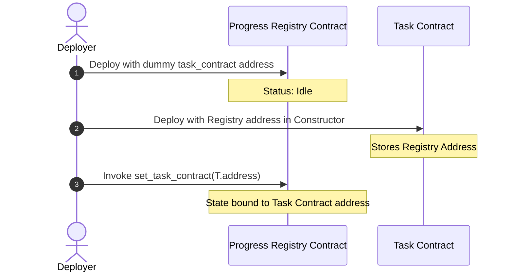

# TaskProof Architecture Document

This document details the system design, mutual circular dependency resolution, dynamic inter-contract execution, event streaming subscriptions, and Freighter wallet integration protocols.

---

## 🏗️ System Overview

The system consists of the React client frontend, Freighter browser wallet integration, and two separate Soroban smart contracts interacting on-chain.

```mermaid
graph TD
    User([User / Developer]) -->|Clicks Connect| FE[React Client Frontend]
    FE -->|Requests Address/Access| FW[Freighter Browser Extension]
    FW -->|Returns Signed Address| FE
    
    subgraph Stellar Network (Testnet)
        FE -->|Submits Tx XDR| RPC[Soroban RPC Endpoint]
        RPC -->|Dispatches Call| TC[Task Contract]
        TC -->|Dynamic Invoke| RC[Progress Registry Contract]
        RC -->|Emits Events| EV[Stellar Ledger Event Stream]
    end

    FE -->|Subscribes to Events| EV
    FE -->|Updates Visual Timeline| FE
```

---

## 🦀 Contract Architecture & Inter-Contract Communication

To guarantee zero vulnerability gaps and satisfy modular audit constraints, states are split between two separate smart contracts:

1. **Task Contract (`contracts/task/`)**: Manages task creation, progress updates, task completion flags, and metadata.
2. **Progress Registry Contract (`contracts/registry/`)**: Stores cryptographic verification hashes, timestamp records, and completes verifier audits.

### Mutual circular references resolution:
At deploy time, both contracts depend on each other's on-chain address:
* The Task Contract constructor takes the Progress Registry address.
* The Progress Registry records proofs and enforces that only the Task Contract can invoke it.

To resolve this circular references bottleneck, we employ the **Linkage Pattern**:
1. Deploy **Progress Registry** passing a temporary/deployer address as the `task_contract`.
2. Deploy **Task Contract** passing the newly created Progress Registry address to the constructor.
3. Invoke `set_task_contract(real_task_contract_address)` on the **Progress Registry** with admin authority to bind it to the actual Task Contract.



### Dynamic Execution Pipeline:
When a developer completes a task:
1. They sign a transaction calling `complete_task(task_id, proof_hash)` on the **Task Contract**.
2. The Task Contract checks authority using `owner.require_auth()`.
3. The Task Contract sets progress to `100` and status to `Completed`.
4. The Task Contract builds a dynamic argument vector and invokes the Registry:
   ```rust
   env.invoke_contract::<()>(&registry_addr, &Symbol::new(&env, "record_proof"), args);
   ```
5. The Progress Registry checks caller authentication (`task_contract.require_auth()`), constructs the `ProofRecord` containing the hash, owner, and timestamp, and writes it to persistent storage.

---

## 📡 Event Streaming & Subscriptions

Soroban contracts publish events for all state changes to minimize on-chain storage costs:

* **Task Contract**:
  * `task_created` (topic: `["task_created", task_id]`, data: `owner_address`)
  * `task_updated` (topic: `["task_updated", task_id]`, data: `progress_percentage`)
  * `task_completed` (topic: `["task_completed", task_id]`, data: `proof_hash`)
* **Progress Registry Contract**:
  * `proof_stored` (topic: `["proof_stored", task_id]`, data: `proof_hash`)

The React client frontend polls the Soroban RPC JSON endpoint `/getEvents` using the contract IDs to filter logs. The client parses topics and updates the Dashboard's **Activity Timeline** in real-time.
